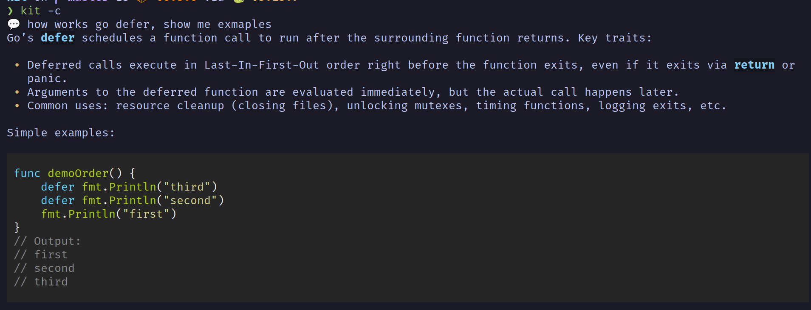

# Kit - AI Terminal Assistant

A powerful command-line interface for interacting with OpenAI's GPT models, designed for developers who prefer working in the terminal. Kit provides multiple specialized chat modes, clipboard integration, and conversation persistence.

## Features

- 🤖 **Multiple AI Modes**
  - Normal Chat - General purpose conversational assistant
  - Codex - Programming assistant with enhanced coding capabilities
  - Web Search - Internet-connected GPT with real-time information
  - IT Security News - Specialized security vulnerability tracker
  - Mail Proofreader - Email text correction and improvement
  - Translator - German ↔ English translation

- 💬 **Chat History**
  - Save and resume conversations
  - Persistent chat sessions across modes
  - Interactive chat selection menu

- 📋 **Clipboard Integration**
  - Read input directly from clipboard
  - Automatic text processing for translation and mail modes

- 🎨 **Rich Terminal UI**
  - Markdown rendering in terminal
  - Color-coded responses
  - Clean, readable output formatting

## Installation

### Prebuilt Binary (Recommended)

#### Prerequisites

- OpenAI API key

Download the latest prebuilt binary from the [Releases](https://github.com/vikingjunior12/kit/releases) page.

```bash
# Linux/macOS
wget https://github.com/vikingjunior12/kit/releases/latest/download/kit
chmod +x kit
sudo mv kit /usr/local/bin/

# Verify installation
kit --version
```


### API Key Setup (Required)

Set up your OpenAI API key:

```bash
export OPENAI_API_KEY='your-api-key-here'
```

Add this to your shell configuration file (`~/.zshrc`, `~/.bashrc`, etc.) to make it permanent:

```bash
echo "export OPENAI_API_KEY='your-api-key-here'" >> ~/.zshrc
source ~/.zshrc
```

## Usage

### Normal Chat (Default)

Interactive general-purpose chat:

```bash
kit
```

Resume a previous conversation:

```bash
kit -r
```

### Codex Mode

Programming assistant with enhanced code understanding:



```bash
kit -c
```

One-shot coding query:

```bash
kit -c "How do I implement binary search in Python?"
```

Resume previous coding session:

```bash
kit -c -r
```

### Web Search

Search the internet using GPT with web search capabilities:

```bash
kit -w
```

Resume web search conversation:

```bash
kit -w -r
```

### IT Security News

Get the latest IT security vulnerabilities and news with curated web search:

```bash
kit -it
```

**How it works:**
- Searches only whitelisted security domains (configurable in `config.json`)
- Default domains: Microsoft Security Response Center, NIST NVD, CISA, BleepingComputer
- Focuses on recent vulnerabilities (last 10 days)
- Returns structured reports with CVEs, severity ratings, and recommended actions
- Customizable via `securityNewsPromt` and `security_domains` in config

**Customize the focus:**
Edit `~/.config/KIterminal/config.json`:
```json
{
  "securityNewsPromt": "Research vulnerabilities for Linux servers and Docker",
  "security_domains": [
    "nvd.nist.gov",
    "cisa.gov",
    "ubuntu.com/security"
  ]
}
```

### Translation

Translate between German and English:

```bash
# From clipboard
kit -t

# Direct text
kit -t "Translate this text"
```

### Mail Proofreader

Proofread and improve email text:

```bash
# From clipboard
kit -m

# Direct text
kit -m "Check this email text"
```

### Configuration Reset

Reset configuration to defaults:

```bash
kit -i
```

## Configuration

Kit stores its configuration in two locations:

### Technical Configuration (`~/.config/KIterminal/config.json`)

Technical settings like model selection, temperature, and token limits:

- Model selections for each mode
- Temperature and token limits
- Reasoning effort settings
- Security news domains whitelist

**Default Models:**
- Normal Chat: `gpt-5.1`
- Codex: `gpt-5.1-codex`
- Web Search: `gpt-5.1`
- IT Security: `gpt-5.1`
- Email: `gpt-5.1`
- Translation: `gpt-5.1`

**Edit config:**
```bash
kit --setup
```

**Reset to defaults:**
```bash
kit -i
```

### AI Instructions (`~/.config/KIterminal/instructions/`)

Each mode has its own instruction file that defines the AI's behavior, tone, and output format. These are plain text files that you can easily customize:

**Instruction Files:**
- `normalchat.txt` - General conversation behavior
- `websearch.txt` - Web search instructions
- `codex.txt` - Programming assistant behavior
- `email.txt` - Email proofreading guidelines
- `translate.txt` - Translation instructions
- `itsecuritynews.txt` - IT security news format

**Edit instructions:**
```bash
# Edit specific mode instructions
kit -e normalchat
kit -e codex
kit -e websearch

# Or edit manually
nano ~/.config/KIterminal/instructions/normalchat.txt
```

**Customization Examples:**

1. **Change response language:**
   Edit `normalchat.txt` and change "Sprich Schweizer Hochdeutsch" to "Respond in English"

2. **Adjust codex verbosity:**
   Edit `codex.txt` and modify the output length guidelines

3. **Customize IT security focus:**
   Edit `itsecuritynews.txt` to focus on your specific tech stack

4. **Change tone:**
   Modify any instruction file to be more formal, casual, technical, etc.

### Language Configuration

Kit supports global language control via a single configuration setting. All instruction files are in English by default, but the AI will respond in your preferred language.

**Set response language:**

Edit `~/.config/KIterminal/config.json`:
```json
{
  "language": "de",  // German
  ...
}
```

Or use the config editor:
```bash
kit -s
# Change "language": "en" to your preferred language
```

**Supported languages:**
- `"en"` - English (default)
- `"de"` - German (Swiss High German without ß)
- `"fr"` - French
- `"es"` - Spanish
- `"it"` - Italian
- `"pt"` - Portuguese
- `"nl"` - Dutch

**How it works:**
- Instruction files remain in English (universal, maintainable)
- The system automatically adds a language instruction prefix to all AI requests
- One setting controls all modes (normalchat, codex, websearch, etc.)
- No duplicate instruction files needed

**Example:**
Setting `"language": "de"` makes all modes respond in German, while keeping instruction files in English for easy maintenance and sharing.

## Chat History

Chat histories are saved automatically in `~/.config/KIterminal/KITchats/`.

- Each mode saves conversations separately
- Resume functionality (`-r` flag) shows a menu of recent chats
- Select a previous conversation or start a new one

## Examples

**Quick code review:**
```bash
kit -c "Review this function for bugs: def calc(x,y): return x/y"
```

**Translate from clipboard:**
```bash
# Copy German text to clipboard, then:
kit -t
```

**Security research:**
```bash
kit -it
# Returns latest CVEs, patches, and security advisories
```

**Interactive coding session:**
```bash
kit -c
# Type 'exit' to quit
```

## Architecture

### Core Components

- **`kit.py`** - Main entry point and CLI argument handling
- **`config.py`** - Configuration management and system prompts
- **`chat_history.py`** - Conversation persistence and resume functionality

### AI Modes

Each mode has:
- Dedicated system prompt optimized for its purpose
- Configurable model selection
- Adjustable verbosity and reasoning effort
- Mode-specific parameters (temperature, tokens, etc.)

## Platform Support

- **Linux** - Full support
- **macOS** - Full support
- **Termux (Android)** - Clipboard integration adapted for Termux environment
- **Windows** - Compatible with WSL

## Tips & Tricks

1. **Resume conversations intelligently** - Use `-r` to continue complex discussions without losing context

2. **Clipboard workflow** - Copy text → run command → get instant results (translation/mail modes)

3. **Codex for scripting** - Use codex mode for shell script generation, debugging, and refactoring

4. **Security monitoring** - Run IT Security News mode daily to stay updated on vulnerabilities

5. **Adjust verbosity** - Edit config.json to control response length per mode

## Troubleshooting

**API Key Error:**
```
Error: OPENAI_API_KEY environment variable not set!
```
→ Set your API key: `export OPENAI_API_KEY='your-key'`

**Import Errors:**
```
ModuleNotFoundError: No module named 'openai'
```
→ Install dependencies: `pip install openai rich prompt_toolkit pyperclip`

**Clipboard Issues (Linux):**
→ Install xclip: `sudo apt install xclip`

**Clipboard Issues (Termux):**
→ Grant storage permissions: `termux-setup-storage`

## Building Standalone Executable

Kit can be built into a standalone executable using PyInstaller:

```bash
pyinstaller kit.spec
```

The executable will be created in the `dist/` directory.

## Contributing

Contributions are welcome! Areas for improvement:
- Additional specialized modes
- Enhanced prompt engineering
- Better error recovery
- Extended platform support

## License

MIT

## Author

Jonas

---

**Note:** This tool requires an active OpenAI API account. Usage incurs costs based on OpenAI's pricing model.
